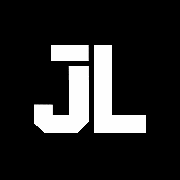

  

# João Victor Silva de Lima

### Full-Stack Developer • Automação, IA e Integrações • Engenharia de Computação @ UTFPR

Construo soluções que unem **software, automação, inteligência artificial, integrações e infraestrutura**  
com foco em aplicações reais, bem pensadas e úteis de verdade.

 

---

## About me

Sou graduando em **Engenharia de Computação na UTFPR** e atuo como **Desenvolvedor Full-Stack**, com experiência prática em aplicações web, automações, integrações entre sistemas, bancos de dados e soluções com IA.

Gosto de construir projetos que vão além do código: soluções que conectam **produto, operação e tecnologia**, transformando processos manuais em fluxos mais inteligentes, organizados e escaláveis.

Atualmente, meu foco está em:

- **Desenvolvimento Full-Stack**
- **Automação de processos**
- **Integrações e APIs**
- **Agentes de IA**
- **Bancos de dados**
- **Infraestrutura, deploy e suporte técnico**

---

## Tech stack

### Front-end

### Back-end

### Automação & IA

### Banco de dados

### Infraestrutura & Ferramentas

### Hardware & Embedded

---

## Featured projects

### Lia — Agente de Atendimento com IA
Agente automatizado de atendimento e automação comercial, desenvolvido com **n8n**, integração com **WhatsApp**, **OpenAI**, **Agendor CRM**, **PostgreSQL** e **APIs REST**.

**Destaques do projeto**
- Atendimento automatizado via WhatsApp
- Coleta e validação de informações
- Persistência de contexto
- Integração com CRM
- Tratamento de erros e logs
- Transferência estruturada para atendimento humano

---

### Portal Jonask
Plataforma web desenvolvida com **React** e **TypeScript**, com múltiplos módulos, ferramentas, conteúdo digital e área premium.

---

### Sequencial
Projeto web comercial com foco em apresentação de produto, estrutura responsiva e experiência visual moderna.

---

## GitHub stats

  

---

## Professional experience

### Uniformizado LTDA
**Desenvolvimento • Automação • Inteligência Artificial**  
**Jun/2026 — Atual**

Atuação no desenvolvimento e evolução de soluções internas com foco em automação, IA e integração entre sistemas.

**Tecnologias e contextos**
- n8n
- OpenAI
- PostgreSQL
- WhatsApp
- Evolution API
- Agendor CRM
- APIs REST
- Webhooks

---

### CHTECH Soluções em T.I.
**Desenvolvimento Full-Stack • Infraestrutura • Suporte**  
**Set/2025 — Jun/2026**

Atuação com desenvolvimento web, manutenção de sistemas, infraestrutura e suporte técnico.

**Tecnologias e contextos**
- PHP
- JavaScript
- MySQL
- WordPress
- WooCommerce
- Linux
- Windows

---

### D’Atri Confecções
**Automação de Processos**  
**Abr/2025 — Ago/2025**

Desenvolvimento de macros, automações de planilhas e rotinas internas com **VBA** e **Excel**.

---

## Education

### Engenharia de Computação — UTFPR
**Universidade Tecnológica Federal do Paraná**  
**2024 — 2029**

---

## Contact

Se você curte tecnologia, automação, IA ou quer trocar ideia sobre projetos, fico à disposição.

  

